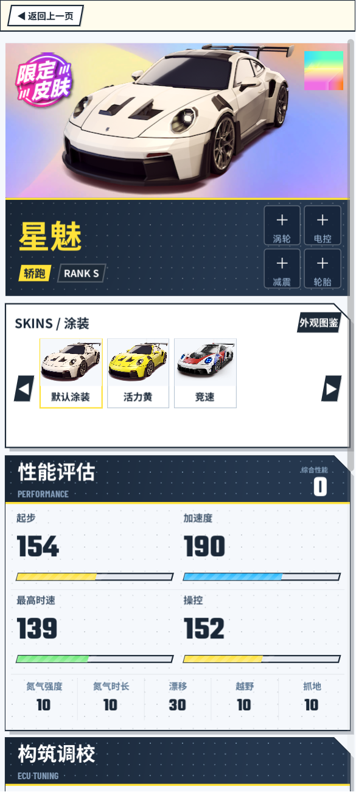

# UIKit · UrhoX 动画组件库

> 轻量、零依赖的 UrhoX / Lua 通用动画组件库，基于引擎内置 Transition 系统 + tween.lua 构建。
> 附带完整业务示例：**HotSlide 绝尘漂移 · 车辆详情页**。

---

## 预览



深色深海配色 · 金色强调 · 折角卡片 · 点阵纹理底纹 · Barlow Condensed 数字字体

---

## 组件一览

| 组件 | 文件 | 用途 |
|------|------|------|
| `Theme` | `UIKit/Theme.lua` | 设计 Token（颜色/字体/间距/组件预设） |
| `AnimModal` | `UIKit/AnimModal.lua` | 弹窗动画（遮罩淡入 + 卡片弹入分离） |
| `StaggerReveal` | `UIKit/StaggerReveal.lua` | 多卡片错开入场动画 |
| `SpringButton` | `UIKit/SpringButton.lua` | 按钮弹簧回弹效果 |
| `RollingNumber` | `UIKit/RollingNumber.lua` | 数字平滑滚动计数器 |

依赖：`tween.lua`（已附带，kikito/tween.lua v2.1.1，UrhoX Lua 5.4 适配版）

---

## 快速开始

将 `scripts/UIKit/` 和 `scripts/tween.lua` 复制到你的项目：

```
your-project/scripts/
  UIKit/
    Theme.lua
    AnimModal.lua
    StaggerReveal.lua
    SpringButton.lua
    RollingNumber.lua
    init.lua
  tween.lua
```

统一引入或按需单独引入：

```lua
-- 统一引入
local UIKit = require("scripts/UIKit")
local Theme = UIKit.Theme

-- 按需引入
local Theme         = require("scripts/UIKit/Theme")
local AnimModal     = require("scripts/UIKit/AnimModal")
local StaggerReveal = require("scripts/UIKit/StaggerReveal")
local SpringButton  = require("scripts/UIKit/SpringButton")
local RollingNumber = require("scripts/UIKit/RollingNumber")
```

---

## API 文档

### Theme — 设计 Token

统一管理 HotSlide 视觉风格的所有设计常量，新游戏引用时可直接使用，也可以 fork 后替换为自己的配色。

#### 颜色

```lua
local Theme = require("scripts/UIKit/Theme")

-- 背景色
Theme.color.pageBg      -- {13, 20, 32, 255}    最深背景 #0d1420
Theme.color.cardBg      -- {17, 27, 46, 255}    卡片背景 #111b2e
Theme.color.headerBg    -- {24, 37, 53, 255}    区块头部

-- 文字
Theme.color.textPrimary -- {255, 255, 255, 255}  白色主文字
Theme.color.textMuted   -- {68, 88, 110, 255}   蓝灰辅助文字

-- 强调色
Theme.color.accent      -- {255, 226, 58, 255}  金黄 #ffe23a
Theme.color.accentBlue  -- {40, 185, 255, 255}  蓝色强调
Theme.color.accentGreen -- {110, 234, 121, 255} 绿色强调

-- NanoVG 用法示例
nvgFillColor(vg, nvgRGBA(table.unpack(Theme.color.accent)))
```

#### Rank 品阶颜色

```lua
Theme.rankColor("S")  --> {255, 226, 58, 255}   金
Theme.rankColor("A")  --> {201, 91, 255, 255}   紫
Theme.rankColor("B")  --> {255, 174, 42, 255}   橙
Theme.rankColor("C")  --> {34, 184, 255, 255}   蓝
```

#### Stat Bar 进度条配色

```lua
Theme.statBarColor(1)  --> 金黄（起步）
Theme.statBarColor(2)  --> 蓝色（加速度）
Theme.statBarColor(3)  --> 绿色（最高时速）
Theme.statBarColor(4)  --> 金黄（操控）
```

#### 字体、字号、间距

```lua
-- 字体路径
Theme.font.number    -- BarlowCondensed-Bold    数值专用
Theme.font.label     -- Teko-Regular            英文标签
Theme.font.body      -- MiSans-Regular          中文正文

-- 字号基准
Theme.fontSize.heroNumber   -- 48  大数值
Theme.fontSize.sectionTitle -- 22  区块标题
Theme.fontSize.body         -- 14  正文

-- 圆角
Theme.radius.card    -- 10
Theme.radius.button  -- 6

-- 间距
Theme.spacing.pagePad   -- 16  页面左右内边距
Theme.spacing.cardPad   -- 14  卡片内边距
```

#### 点阵纹理参数

```lua
-- DrawDotGrid 函数参数直接透传
Theme.dotGrid.dotR   -- 1.0   点半径
Theme.dotGrid.gap    -- 18    点间距
Theme.dotGrid.color  -- {255, 255, 255, 12}  极低透明度白
```

#### 组件预设（直接传给 UIKit 各组件）

```lua
-- AnimModal 预设
local modal = AnimModal.new(overlayLayer, Theme.modalPreset)

-- StaggerReveal 预设
StaggerReveal(cards, Theme.staggerPreset)

-- SpringButton 预设
SpringButton.wrap(btn, onClick, Theme.springPreset)
```

---

### AnimModal — 弹窗动画系统

遮罩层仅做 `opacity` 淡入淡出，弹窗卡片单独做 `scale + translateY` 弹入弹出，两层分离，避免遮罩随卡片缩放的视觉问题。

```lua
local modal = AnimModal.new(overlayLayer, Theme.modalPreset)

-- 打开弹窗（overlay=全屏遮罩，card=弹窗卡片，由业务代码创建）
modal:Open(overlay, card)

-- 关闭弹窗（带动画，自动延迟移除节点）
modal:Close()

-- 判断是否有弹窗在显示
modal:IsOpen()  --> boolean
```

**自定义配置：**

```lua
AnimModal.new(overlayLayer, {
    openOverlayT  = "opacity 0.22s easeOut",
    openCardT     = "scale 0.30s easeOutBack, translateY 0.28s easeOut",
    closeOverlayT = "opacity 0.22s easeOut",
    closeCardT    = "scale 0.20s easeIn, translateY 0.20s easeIn",
    closeDelay    = 0.25,
    cardInitScale = 0.88,
    cardInitY     = 14,
})
```

---

### StaggerReveal — 错开入场动画

传入 Panel 数组，自动依次触发淡入 + 向上位移入场。适合仪表盘、卡片列表的首次出现动画。

```lua
-- 使用 Theme 预设
StaggerReveal({ card1, card2, card3, card4 }, Theme.staggerPreset)

-- 或自定义
StaggerReveal(cards, {
    startDelay = 0.08,
    interval   = 0.10,
    initY      = 28,
    transition = "opacity 0.40s easeOut, translateY 0.42s easeOutBack",
})
```

---

### SpringButton — 弹簧回弹按钮

```lua
-- 模式 A：包装已有 Widget（推荐，非侵入）
SpringButton.wrap(existingWidget, function()
    -- 点击回调
end, Theme.springPreset)

-- 模式 B：直接创建带弹簧效果的新按钮
local btn = SpringButton.new({
    text    = "确认",
    variant = "primary",
    onClick = function() ... end,
})
```

---

### RollingNumber — 数字滚动计数器

```lua
local counter = RollingNumber.new({
    initial  = 0,
    duration = 1.0,
    easing   = "outQuad",
    format   = function(v) return tostring(math.floor(v)) end,
})

-- 每帧驱动
SubscribeToEvent("Update", function(et, ed)
    counter:Update(ed["TimeStep"]:GetFloat())
end)

counter:Set(594)   -- 触发滚动到新值
counter:Jump(0)    -- 立即跳到（不播动画）
counter:Get()      -- 读取当前显示值（string）
counter:Raw()      -- 读取当前浮点值
```

---

## 示例提示词

以下提示词可直接用于向 AI 请求基于 UIKit 构建新页面：

### 示例一：游戏大厅页

```
我在用 UrhoX + Lua 做一个赛车游戏大厅页面，
请参考 scripts/UIKit/ 组件库来实现，风格参考 HotSlide 示例（Theme.lua）。

页面需求：
- 顶部：玩家信息栏（头像占位、昵称、等级标签）
- 中间：快速匹配大按钮
- 中间：三个模式卡片（单人计时 / 多人竞速 / 团队赛）
- 底部：导航栏（大厅 / 车库 / 商城 / 排行榜）

UIKit 使用要求：
- 页面卡片入场用 StaggerReveal（传入 Theme.staggerPreset）
- 匹配按钮用 SpringButton.new（传入 Theme.springPreset）
- 匹配倒计时用 RollingNumber
- 弹出"匹配成功"用 AnimModal（传入 Theme.modalPreset）

视觉参考 Theme.color / Theme.fontSize / Theme.spacing，
点阵底纹参数用 Theme.dotGrid。
```

### 示例二：角色/英雄详情页

```
我在用 UrhoX + Lua 做一个 MOBA 游戏的英雄详情页，
请参考 scripts/UIKit/ 组件库，风格沿用 HotSlide Theme。

页面需求：
- 顶部：英雄立绘展示区（全屏背景图 + 英雄名）
- 属性面板：6项属性 + StatBar 进度条（参考 Theme.statBarColor）
- 技能列表：4个技能卡片，点击弹出技能详情（用 AnimModal）
- 皮肤切换：横向滚动缩略图行（参考 HotSlide skins.lua 结构）

UIKit 使用要求：
- 属性和技能卡片入场用 StaggerReveal
- 技能详情弹窗用 AnimModal
- 技能卡片点击用 SpringButton.wrap
- Rank 品阶标签颜色用 Theme.rankColor
```

### 示例三：排行榜页

```
我在用 UrhoX + Lua 做排行榜页面，
请参考 scripts/UIKit/ 组件库，风格沿用 HotSlide Theme。

页面需求：
- 顶部 Tab：全服榜 / 好友榜（切换用 SpringButton.wrap）
- 排名列表：前 3 名特殊样式，4-10 名标准行
- 当前玩家行：固定在底部，分数用 RollingNumber 动画更新
- 刷新按钮：点击后数值重新滚动到新成绩

UIKit 使用要求：
- 列表卡片入场用 StaggerReveal
- Tab 按钮用 SpringButton.wrap
- 分数用 RollingNumber（duration=1.2, easing="outQuad"）
- 颜色全部取 Theme.color.*，字体取 Theme.font.*
```

---

## 示例项目：HotSlide 绝尘漂移 · 车辆详情页

`scripts/` 目录中包含完整的业务示例，展示 UIKit 在真实 UI 项目中的用法：

```
scripts/
  UIKit/                   ← 组件库（本体，可直接复制复用）
  tween.lua                ← 缓动引擎（UIKit 依赖）

  main.lua                 ← 示例入口（演示 AnimModal + StaggerReveal）
  state.lua                ← 响应式状态（零件换装 → 属性联动）
  constants.lua            ← 数据常量（颜色已迁移至 UIKit/Theme.lua）
  helpers.lua              ← 布局工厂（MakeCard / MakeCardHeader 等）
  widgets.lua              ← NanoVG 自定义控件（SurfacePanel / StatBar / DrawDotGrid）

  sections/
    performance.lua        ← 演示 RollingNumber
    tuning.lua             ← 演示 SpringButton.wrap
    skins.lua              ← 演示 SpringButton.wrap（涂装切换）
    parts_modal.lua        ← 演示 AnimModal（返回 overlay, card 两个值）
    ...
```

---

## 技术栈

| 层 | 技术 |
|----|------|
| 引擎 | UrhoX（TapTap 星火编辑器） |
| 脚本 | Lua 5.4 |
| UI 布局 | urhox-libs/UI（Yoga Flexbox） |
| 自定义绘制 | NanoVG（矢量图形） |
| 动画过渡 | 引擎内置 Transition 系统（CSS-like） |
| 缓动引擎 | tween.lua v2.1.1（kikito） |

---

## License

MIT
